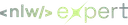

<div align="center" id="top"> 
  
</div>

<h1 align="center">Rocketseat NLW Expert – React Native</h1>

<p align="center">
  

  

  
</p>

<p align="center">
  <a href="#dart-about">About</a> &#xa0; | &#xa0; 
  <a href="#sparkles-features">Features</a> &#xa0; | &#xa0;
  <a href="#rocket-technologies">Technologies</a> &#xa0; | &#xa0;
  <a href="#white_check_mark-requirements">Requirements</a> &#xa0; | &#xa0;
  <a href="#checkered_flag-starting">Starting</a> &#xa0; | &#xa0;
  <a href="https://github.com/oliveiralecca" target="_blank">Author</a>
</p>

<br>

## :dart: About ##

This project was developed on the 14th edition of Rocketseat's famous event called Next Level Week. On this front-end trail, a restaurant menu mobile app was built.

## :sparkles: Features ##

:heavy_check_mark: &nbsp;Navigate on the foods menu;\
:heavy_check_mark: &nbsp;Navigate through foods categories;\
:heavy_check_mark: &nbsp;Choose the foods you want and send it to the cart;\
:heavy_check_mark: &nbsp;Clean the cart;\
:heavy_check_mark: &nbsp;Send the ask to the restaurant whatsapp with all the items and the total price.

## :rocket: Technologies ##

The following tools were used in this project:

- [Expo](https://expo.io/)
- [React Native](https://reactnative.dev/)
- [TypeScript](https://www.typescriptlang.org/)
- [Tailwind CSS](https://tailwindcss.com/)
- [Zustand](https://zustand-demo.pmnd.rs/)

## :white_check_mark: Requirements ##

Before starting :checkered_flag:, you need to have [Git](https://git-scm.com), [Node](https://nodejs.org/en/) and [Expo](https://expo.io/) installed.

## :checkered_flag: Starting ##

```bash
# Clone this project
$ git clone https://github.com/oliveiralecca/rocketseat-nlw-expert-react-native

# Access
$ cd rocketseat-nlw-expert-react-native

# Install dependencies
$ npm i

# Run the project
$ npx expo start

# Then you can open the project on a simulator
# Or download the Expo Go app on your phone and scan the QRCode to open the project
```

&#xa0;

Made with 💕 by <a href="https://github.com/oliveiralecca" target="_blank">Letícia Oliveira</a>

&#xa0;

<a href="#top">Back to top :top:</a>
